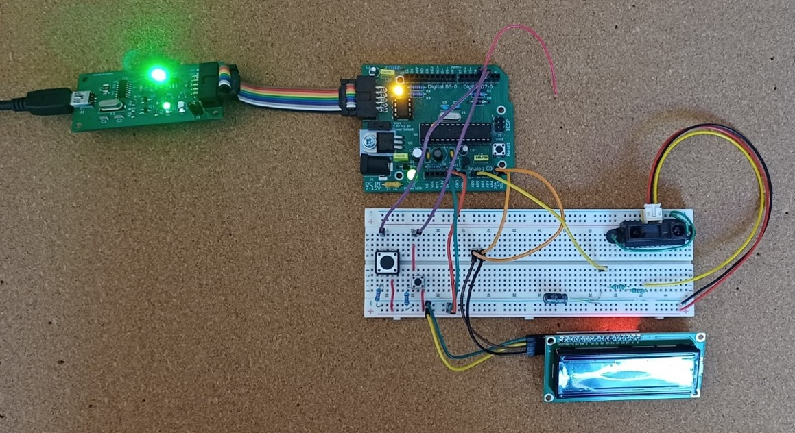
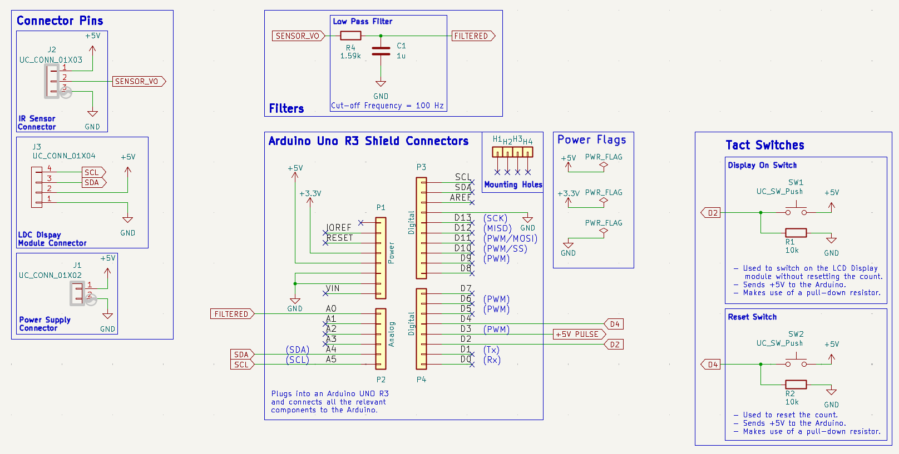
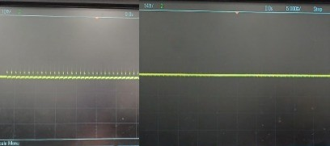
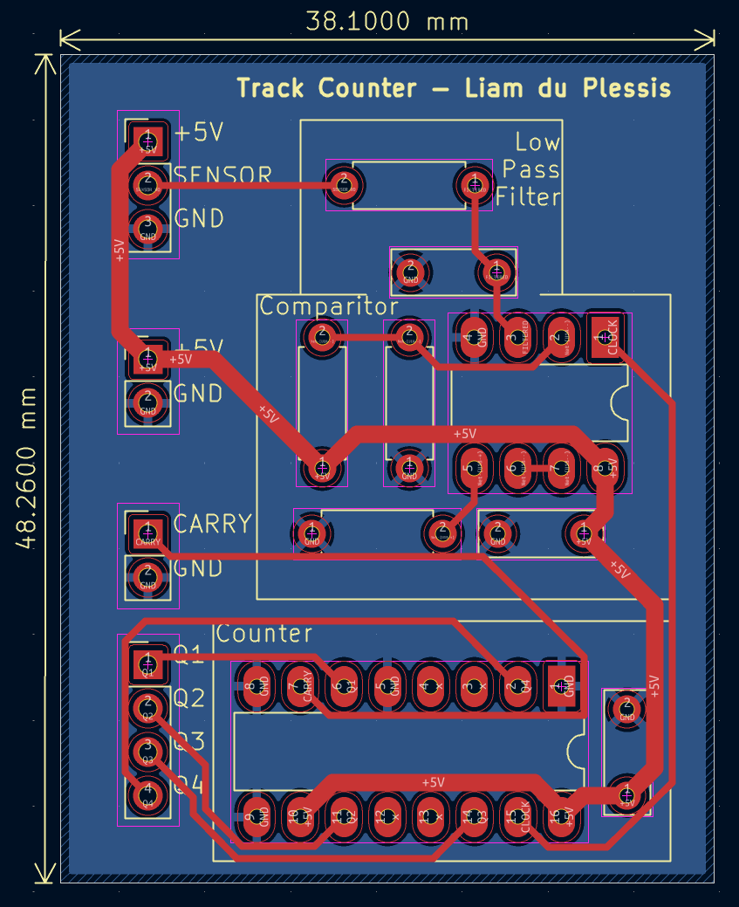
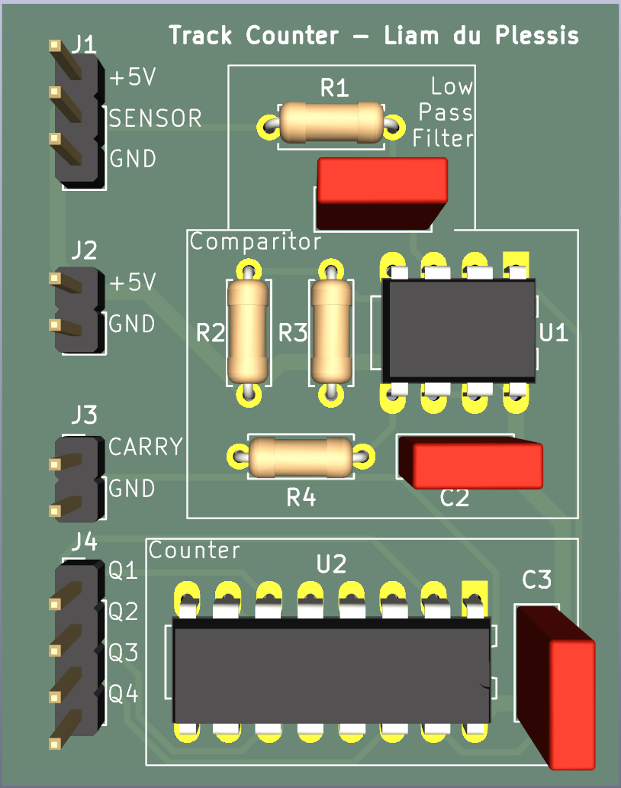

# Track Counter

An automated, low-power Track Counter that detects and records visitor traffic on walking and mountain-bike trails, removing the need for manual counts. Built as a proof-of-concept for organizations such as the Department of Conservation (DOC), the device uses an infrared (IR) sensor to detect passing visitors, stores the count locally on an Arduino, outputs a trigger pulse for optional external devices (e.g. a camera), and displays the accumulated count on an LCD at the press of a button.

Created: March 2025\
GitHub upload: Jul 2026

## Contributors

- Liam du Plessis
- Mark Watkins
- Samuel Holmes

## Breadboard prototype & Schematics

## Design Overview

The Track Counter meets the following design requirements:

- Uses a Sharp IR distance sensor to detect visitors on the track
- Stores the detection count locally, with no external cable or internet connection required
- Outputs a rectangular "trigger" pulse (50–100 ms, 4.5–5.2 V) with each detection
- Displays the count on an LCD at the press of a button
- Allows the count to be reset at the press of a separate button
- Detects visitors within a range of 40 cm (adjustable in software)
- Runs from a 5 V DC, 10,000 mAh power supply

## Hardware Description

| Building Block | Description |
|---|---|
| Arduino UNO R3 | Executes the program, stores the detection count, and communicates with all other components |
| Sharp IR Sensor (GP2Y0A21YK) | Converts a measured distance into a corresponding voltage signal |
| Low-Pass Filter | Passive RC filter (1 µF capacitor, 1.59 kΩ resistor, ~100 Hz cutoff) that removes high-frequency noise from the sensor signal before it reaches the Arduino |
| LCD Display Module (16×2, I2C) | Displays the current count to the surveyor |
| Tact Switches | Two buttons — a larger one to activate the display, and a smaller, less accessible one to reset the count — each using a 10 kΩ pull-down resistor for a clearly defined signal |

**Schematic**

**Arduino pin mapping:**

| Pin | Signal Type | Linked Component |
|---|---|---|
| A0 | Analog Input | IR sensor (via low-pass filter) |
| A4 / SDA | Analog | LCD module |
| A5 / SCL | Analog | LCD module |
| D2 | Digital Input | Display switch |
| D3 | Digital Output | Trigger signal |
| D4 | Digital Input | Reset switch |

A low-pass filter (rather than a Schmitt trigger) was chosen to clean up the IR sensor signal, as it is a cheap, compact, passive solution that avoids the extra power draw of an op-amp. Schematics and prototype photos are included in the full project report.

**Low-Pass Filter**

\
Before VS After signal

## Software Description

The Arduino is programmed via the Arduino IDE and runs a simple state-driven main loop:

1. On startup, the program initializes a `count` variable (set to 0) and a `tickOver` locking variable (set to locked).
2. Each loop iteration, the IR sensor voltage is read and passed through a low-pass filter.
3. When the sensor voltage crosses below the `CROSS_OVER_VOLTAGE` threshold, an object is considered "detected" and the counter unlocks.
4. When the voltage crosses back above the threshold (object leaving range), the `count` is incremented once, a 5 V trigger pulse is output, and the counter re-locks — preventing a single visitor from being counted multiple times while in range.
5. On every loop iteration, the count is written to the LCD (regardless of lock state), and the display/reset buttons are checked so they remain responsive at all times.
6. Pressing the display button turns the LCD on; releasing it turns the LCD off (a pull-down resistor prevents floating-voltage flicker).
7. Pressing the reset button clears the LCD and sets `count` back to 0, without resetting the entire Arduino program.

The LCD is driven using [Bill Perry's hd44780 library](https://github.com/duinoWitchery/hd44780), communicating over I2C (SDA/SCL).

## Bill of Materials

Total hardware cost: **$22.84 NZD** (well within the $40 budget constraint)

| Component | Quantity | Unit Cost ($) | Total Cost ($) |
|---|---|---|---|
| LCD Module | 1 | 6.00 | 6.00 |
| IR Distance Sensor | 1 | 6.80 | 6.80 |
| Solid Core Wire (per metre) | 0.05 m | 0.70 | 0.04 |
| Dupont Cables (M–M) | 7 | 0.00 | 0.00 |
| Dupont Cables (M–F) | 4 | 0.00 | 0.00 |
| Momentary Tact Switch (6 mm) | 1 | 0.25 | 0.25 |
| Momentary Tact Switch (12 mm) | 1 | 0.65 | 0.65 |
| Electrolytic Capacitor (1 µF) | 1 | 0.10 | 0.10 |
| Resistor | 4 | 0.00 | 0.00 |
| Arduino UNO | 1 | 9.00 | 9.00 |
| **Total** | | | **22.84** |

*Component pricing based on the UC Components Store catalogue.*

## Known Limitations

- Battery life is estimated at **5.95 days** under continuous sensor operation with a 10,000 mAh supply — short of the 10-day target. Limiting sensor activity to daylight hours (~12 hrs/day) improves this to ~7.72 days; further options include a FET-controlled sensor power switch for scheduled sensing windows.
- Groups of visitors passing closely together may be counted as a single detection event, due to the locking mechanism used to prevent multi-counting.

## Early Version PCB

This project followed introdutory labs in which initial versions of the step counter was made. This version includes a PCB layout shown below.

\
PCB Layout (Made by Liam du Plessis)

\
PCB CAD Model
